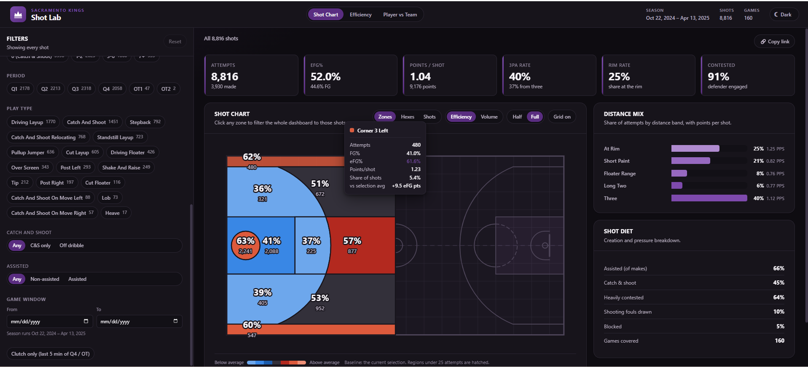
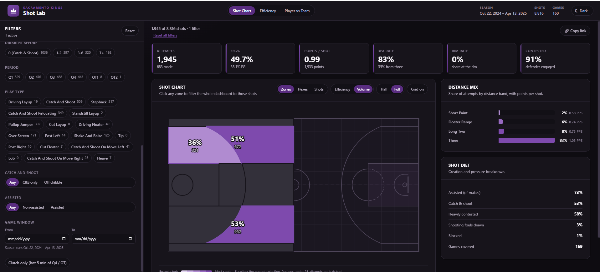
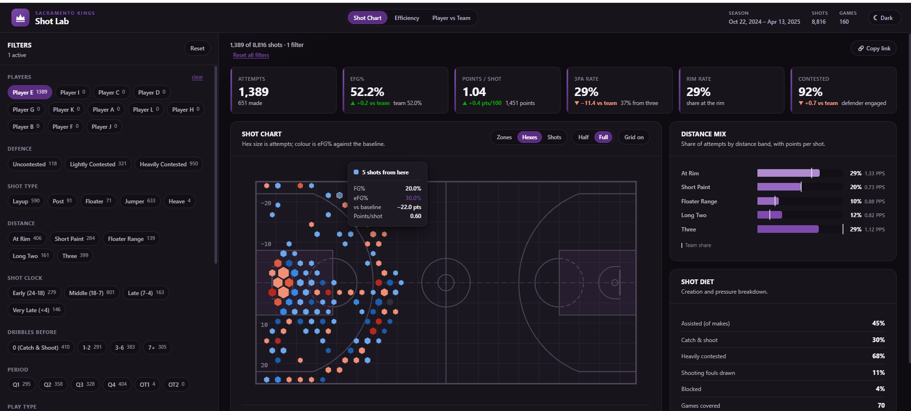
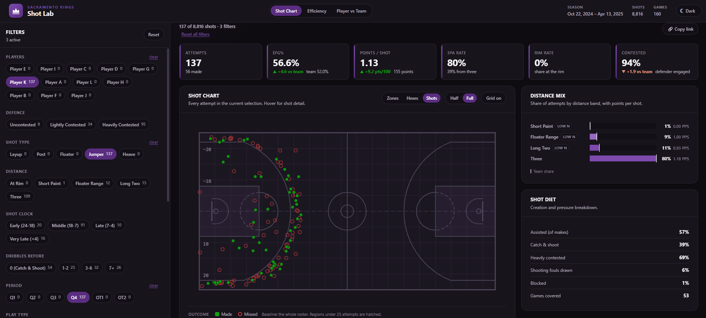
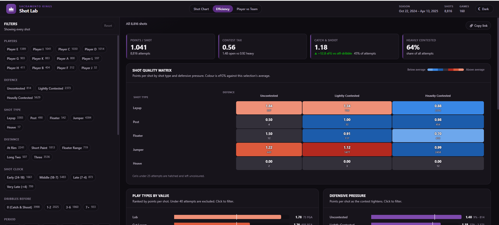
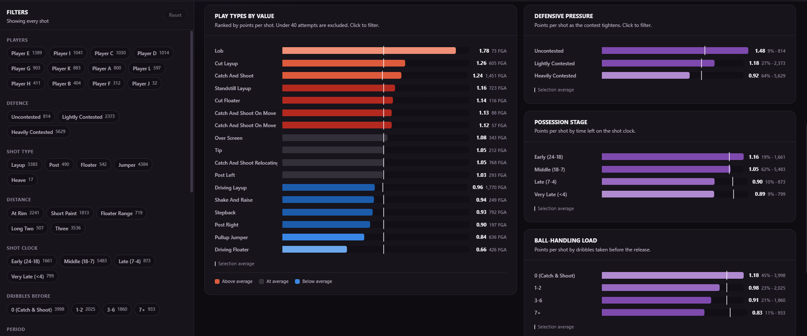
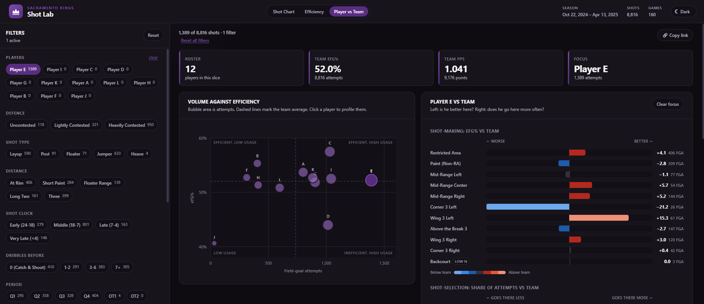
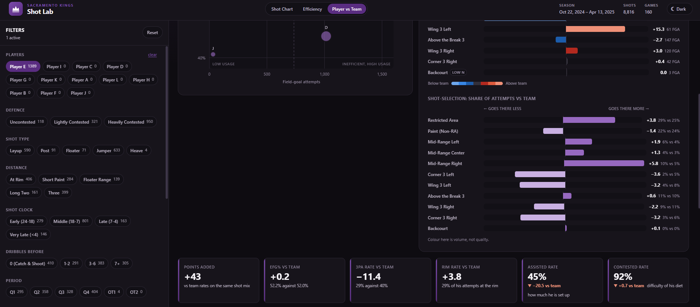
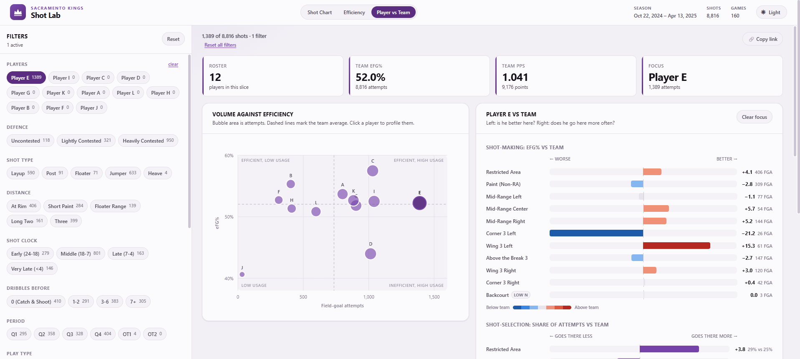

# Kings Shot Lab

A shot-profile dashboard for 12 players from the 2024–25 regular
season. It answers four questions a staff actually asks:

- Which players take which shots, and from where?
- Which shots are efficient, and which aren't?
- How does shot-making change with context: defense, shot clock, dribbles?
- How does each player deviate from the team profile?

**8,816 shots & 12 players & 160 games & 2024-10-22 to 2025-04-13**

---
COMPLETE USAGE VEDIO LINK: 

## Run it

Needs **Node 18+**. Everything lives in the `app/` folder.

```bash
cd app
npm install
npm run dev
```

Open **http://localhost:5173**.

`npm run dev` runs the ETL first automatically, it reads `data/shots.csv` and
writes `app/public/data/shots.json`. No server, no database, no API keys.

Other commands:

```bash
npm run build     
npm run data       # regenerate the dataset from the CSV
npm run typecheck  
```

---

## The three views

### 1. Shot Chart: where shots come from and how they convert

The court is drawn in real court length, with three switchable layers:

- **Zones**: 11 standard zones, colored by efficiency or volume. Clicking a zone
  filters the entire dashboard to those shots.
- **Hexes**: size = attempts, color = eFG% vs baseline.
- **Shots**: every attempt; made = filled dot, missed = open ring.



*Zones on efficiency colouring, hovering Corner 3 Left for the full breakdown.*



*Same zones on volume colouring, filtered to threes on purpose so only 3 zones light up and you can see the filter driving the court.*



*Hexes for one player, size is attempts and colour is eFG% against the baseline.*



*Every individual attempt for one player's Q4 jumpers, green made and red missed.*

### 2. Efficiency: which shots pay, and how context changes them

The centrepiece is a **shot type × defensive pressure** matrix, because shot
quality is two-variable: the same floater is a good shot open and a bad one
contested. A single ranked list hides that. play types by value, context
breakdowns (pressure, shot clock, dribbles).



*The matrix, where a layup goes from 1.84 open to 0.88 heavily contested.*



*Play types ranked by points per shot, with the pressure, shot clock and dribble breakdowns beside them.*

### 3. Player vs Team: how each player deviates

- **Volume vs efficiency scatter**, bubble area = attempts, crosshair at team means.
- **Two bars side by side**: shot-*making* (eFG% vs team, per zone) and
  shot-*selection* (attempt share vs team). A player can be +8 eFG% in the corners
  while taking fewer of them... that's a play design finding, not a shooting one.
- **Roster table** with a points-added column (points above or below what the team
  would score on the same shot distribution).



*The roster scatter with Player E selected, and his eFG% deltas by zone.*



*Scrolled down to the shot-selection deltas and the focus strip.*

### Filters and theming

One filter base shared by all three views, so a it survives switching views.
Every option shows a live attempt count.
The filter section is drag resizable and light and dark themes are both supported.



*The same Player vs Team view in light mode.*

---

## Problems hit, and how they were solved

### eFG% showing 100–150%

The most interesting bug. Filtering to "Assisted" pushed eFG% to exactly show 100% for 2 pointers and 150 for 3 pointers which is teh ideal %age indicating every assisted attempt was converted. This seems unlikely, so on further investigation:

**Cause:** not a math error, a data-semantics one. In the source, `assisted` is
`TRUE` on **2,586 makes and 0 misses** an assist is only credited on a made
basket. So filtering to assisted shots selects makes *only*, forcing FG% to 100%,
and since eFG% adds 0.5 per made three it lands at a PERFECT %. The number was
correct; the filter was meaningless.

**Fix:** filter on **`ast_opp`** instead ehich is assist opportunity. That describes the *look* and exists on makes and misses alike so efficiency stays honest.

### The scatter chart showed negative attempts

Axis padding (12% of range) was applied to a count axis, pushing the minimum below
zero: "-131 attempts." handled by d3-scale's `.nice()`, which rounds the domain to clean brackets of attempts.

---

## Choices, and why

| Choice | Reasoning |
|---|---|
| **Static SPA, no backend** | I started a FastAPI + SQLite backend and deleted it. The brief calls for a lightweight solution; for 8,816 immutable rows a server adds a process to run and buys nothing. The data rigor moved into a build-time ETL instead. |
| **Build-time ETL** | Distance, zone, buckets and flags are derived once at build time, so the browser does analytics, not data-prep. Filtering stays in single-digit milliseconds. |
| **Columnar + dictionary-encoded JSON** | `decode.ts` unpacks it once at load, so exactly one file knows the compact format and everything else reads |
| **Zustand for state** | The store holds filter *criteria* only; filtered shots come from a memoized selector |
| **No input validation** | The brief states the data is clean and asks for a simple solution, so the ETL trusts the CSV. A comment in `build-dataset.mjs` marks where column/number/zone guards would go if it couldn't. |
| **Low sample marked, not hidden** | Under 25 attempts, cells are hatched and labelled "low n" rather than dropped. hiding it loses information but shouldnet be "shown" |

**Stack:** React 18 + TypeScript + Vite 6 + Zustand + CSS Modules + papaparse + d3 libraries + clsx.

---

## Scaling up

The current design whole dataset in memory, linear filter scans, one SVG node per shot. 
For millions of shots or many seasons:

- **Data:** move the ETL to Parquet + DuckDB or a warehouse
- **Serving:** add a thin aggregation API taht send raw shots only for the current filter.
- **Client:** render the shot layer on canvas/WebGL instead of thousands of DOM
  nodes; I have experiance with WebGL: https://atharvakirkole.github.io

---

## Known gaps

- **No test suite.** The geometry and metrics are pure functions and the data is pure so the obvious
  next step.
- **Insights are rule-based arithmetic**, not statistical verifiable by eye, but a
  larger sample would justify confidence intervals.

// LATEST ADDED: URL CAN BE COPIED WITH THE FILTERS!